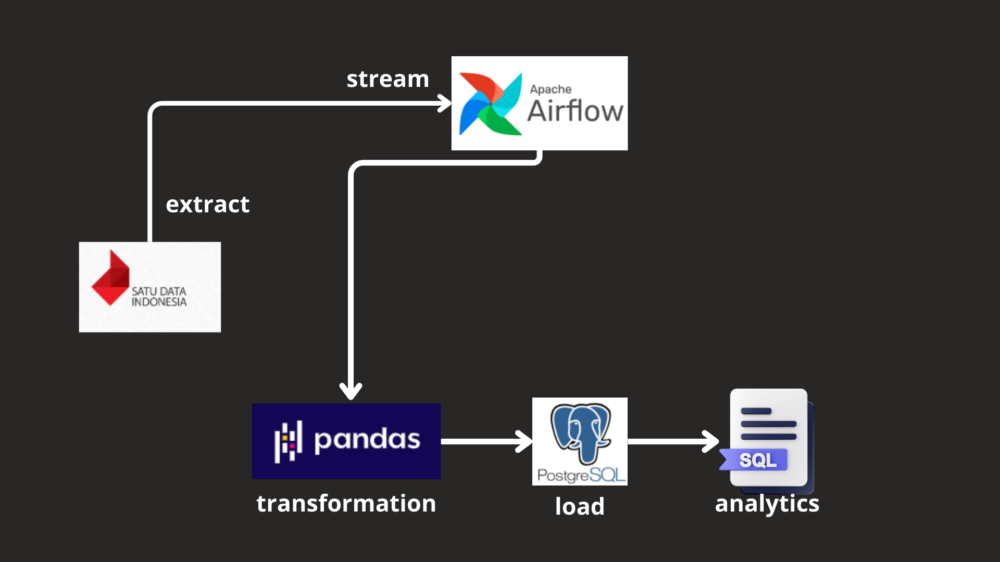

# end_to_end-data_BBM


# Objective 
```
Membangun pipeline untuk menghasilkan data csv ke datawarehouse agar dapat dianalisa oleh divisi data analis
```


# workflow



# SQL query find most jumlah penjualan
```
--search most jumlah_penjualan
select jumlah_penjualan,jenis_bahanbakar, periode_data  from bbm
where stasiun_pengisian_bahanbakar='Pertamina' and jumlah_penjualan  > 0
order by jumlah_penjualan DESC
```


# tools
```
- Apache Airflow 
- Python 
- Pandas
- PostgresSQL
```

# result
